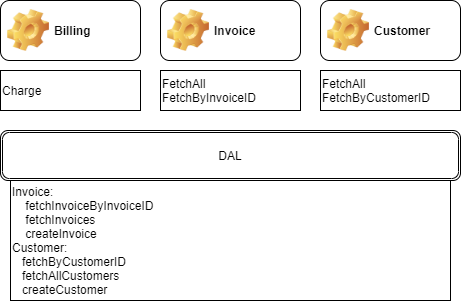

## Antaeus

Antaeus (/ænˈtiːəs/), in Greek mythology, a giant of Libya, the son of the sea god Poseidon and the Earth goddess Gaia. He compelled all strangers who were passing through the country to wrestle with him. Whenever Antaeus touched the Earth (his mother), his strength was renewed, so that even if thrown to the ground, he was invincible. Heracles, in combat with him, discovered the source of his strength and, lifting him up from Earth, crushed him to death.

Welcome to our challenge.

## The challenge

As most "Software as a Service" (SaaS) companies, Pleo needs to charge a subscription fee every month. Our database contains a few invoices for the different markets in which we operate. Your task is to build the logic that will schedule payment of those invoices on the first of the month. While this may seem simple, there is space for some decisions to be taken and you will be expected to justify them.

## Instructions

Fork this repo with your solution. Ideally, we'd like to see your progression through commits, and don't forget to update the README.md to explain your thought process.

Please let us know how long the challenge takes you. We're not looking for how speedy or lengthy you are. It's just really to give us a clearer idea of what you've produced in the time you decided to take. Feel free to go as big or as small as you want.

## Developing

Requirements:
- \>= Java 11 environment

Open the project using your favorite text editor. If you are using IntelliJ, you can open the `build.gradle.kts` file and it is gonna setup the project in the IDE for you.

### Building

```
./gradlew build
```

### Running

There are 2 options for running Anteus. You either need libsqlite3 or docker. Docker is easier but requires some docker knowledge. We do recommend docker though.

*Running Natively*

Native java with sqlite (requires libsqlite3):

If you use homebrew on MacOS `brew install sqlite`.

```
./gradlew run
```

*Running through docker*

Install docker for your platform

```
docker build -t antaeus
docker run antaeus
```

### App Structure
The code given is structured as follows. Feel free however to modify the structure to fit your needs.
```
├── buildSrc
|  | gradle build scripts and project wide dependency declarations
|  └ src/main/kotlin/utils.kt 
|      Dependencies
|
├── pleo-antaeus-app
|       main() & initialization
|
├── pleo-antaeus-core
|       This is probably where you will introduce most of your new code.
|       Pay attention to the PaymentProvider and BillingService class.
|
├── pleo-antaeus-data
|       Module interfacing with the database. Contains the database 
|       models, mappings and access layer.
|
├── pleo-antaeus-models
|       Definition of the Internal and API models used throughout the
|       application.
|
└── pleo-antaeus-rest
        Entry point for HTTP REST API. This is where the routes are defined.
```

### Main Libraries and dependencies
* [Exposed](https://github.com/JetBrains/Exposed) - DSL for type-safe SQL
* [Javalin](https://javalin.io/) - Simple web framework (for REST)
* [kotlin-logging](https://github.com/MicroUtils/kotlin-logging) - Simple logging framework for Kotlin
* [JUnit 5](https://junit.org/junit5/) - Testing framework
* [Mockk](https://mockk.io/) - Mocking library
* [Sqlite3](https://sqlite.org/index.html) - Database storage engine

Happy hacking 😁!

### Here I GO!!!

Not a Java/Kotlin expert at all but I enjoy solving puzzles...

Challenge: "few invoices for the different markets ... schedule payment of those invoices on the first of the month".

### Backend App Primary Function
Backend to charge invoices on a specific day of month.

#### As-Is



Above is a simple diagram showing the existing Functionality within the backend service.

#### To-Be
Below diagram, I have identified the typical functions needed in order to handle invoices charging.


##### Invoices 
* Check Status / keep track
* Update Status
* Check Customer Currency / Convert
* Retry Failed Invoices
* Apply Discount
* Charge Interest due to Overdue Invoices

The backend should handle exceptions like:
1. Network  
2. Currency Mismatches 
3. Insufficient balance 
4. Customers Not Found

##### Customer
* Suspend Customer
* Update Customer Details (Currency)

##### Job Schedule
* Mark Invoices to be Charged for Next Run
* Schedule a Monthly Job

##### Email / Notification
* Get a List of Failed Invoices to be checked -> Escalate
* Create a Notification Message
* Inform Customer about Invoice Status

My implementation is basic and does not cover all the aspects of Error handling logging encryption etc.

### PLEO-ANTAEUS-CORE:
### SERVICE
#### Invoice  
Present:
Functions ->
* Fetch All Invoices
* Fetch Invoice By ID

ToDo: 
Functions ->
* Update Invoice: Paid to be done (Not Paid / Error) - *Done*

My implementation calls the updateInvoice within the DAL, it allows to updateStatus of any sort.
* Fetch Invoice(s) by Status - *Done*

I have implemented an abstract fetchInvoiceByStatus function in order to cater for various statuses when charging happens or various other processes might need. 
* convertCurrency

The convert currency function could be called if the Customer' currency is different than the charging company' currency before a charge is made - *outstanding*

#### Billing 
Present: 
Functions ->
* Charge (TODO)

ToDO:
Functions ->
* Charge Single Invoice - *Done Basic Only*

When calling the PaymentProvider check for execeptions like mentioned above which is returned.

* Check status of Invoice before trying to Charge(paymentProvider) - *Done Basic Only*

Before I update the invoice I check if the PaymentProvider was successful.

* Charge All Invoices create logger - *Done Basic Only*

The schedule Job would need a functionality in order to charge multiple invoices / multiple customers. ChargeInvoices(by unpaid status) calls the chargeSingleInvoice function and writes a logger. This is still very basic. Here I will implement a Logging Service that can track each charge of when and what happened.

* HandleFailedInvoices - retry - *outstanding*

This function should be created to retry when there were failed invoices, it could be called ad-hoc or by a scheduling service.

* applyDiscount - *outstanding*

It could be that discounts could be applied and the invoice amt should be adjusted.

* chargeInterest - *outstanding*

If a customer is unsuccessful and the invoice is already overdue based on payment terms the backend func can be called to add interest.


#### Customer
Present: 
Functions ->
* FectchAll Customers
* FecthByID

ToDo:
Functions ->
* suspendCustomerSubscription - *outstanding*

If a customer is not paying the subscription service should be terminated.
* updateCustomerDetails

If a customer' details change like currency etc. This func can assist.

#### Job Schedule
ToDo:
Functions ->
* markInvoicesToBeCharged - *outstanding*

For the schedule Job Service to work a function needs to be created to check which of the invoices should be charged. This could then be used as a status or indicator for the billing Service.
* createInvoiceRun

Actual Job that will executed perhaps with a cron etc.

#### Email/Notification
ToDo:
Functions ->
* getListOfFailedInvoices - *outstanding*

If a company has a process for the financial clerks to follow-up on unpaid invoices.
* createNotificationMessage - *outstanding*

Actual function to create a template message / email.
* InformCustomeraboutStatus - *outstanding*

Call the CreateNotificationMessage for customers with unpaid Invoices.
* createStatements - *outstanding*

Provide a statement for the account based on invoice status
* handleFailedNotifications - *outstanding*

If the email was unsuccessful retry send or provide a list of issues.

## 2020/08/26
### Extension
Try 
* Scheduled monthly job
* logging output that shows successful/failed charges as they occur
* Some way to test/verify/trigger the monthly scheduled job

- No Time :)
* Network retries

#### Schedule Monthly Job / Logging / Trigger
##### BillingService.kt
I have revisted  ..\antaeus\core\services\BillingService.kt
With my previous implementation it was not possible to have a schedule.

Found documentation to use Kotlin with a Scheduler you could implement it by using quartz - https://www.baeldung.com/quartz
The key interfaces of the API are:

imported the nessary org.quartz* libraries. Attempted the CronTriggers

http://www.quartz-scheduler.org/documentation/2.4.0-SNAPSHOT/tutorials/

Imported the org.slf4j.LoggerFactory given that it was already available in the API.

##### pleo-antaeus-core\build.gradle.kts
Added the API for Quartz


##### pleo-antaeus-app\src\main\kotlin\io\pleo\antaeus\app\utils.kt
Added the Monthly Schedule
The Cron expression I have will translate the following schedule as shown below:
0 0 23 L 1/1 ? *
* Mon Aug 31 23:00:00 UTC 2020


##### pleo-antaeus-app\src\main\kotlin\io\pleo\antaeus\app\AntaeusApp.kt
Adjusted Billing Service with addtional Parameters


##### pleo-antaeus-core\src\main\kotlin\io\pleo\antaeus\core\jobs\JobSchedule.kt
Created the JobSchedule that that will call the BillingService Invoice charge
Used the slf4j.LoggerFactory


