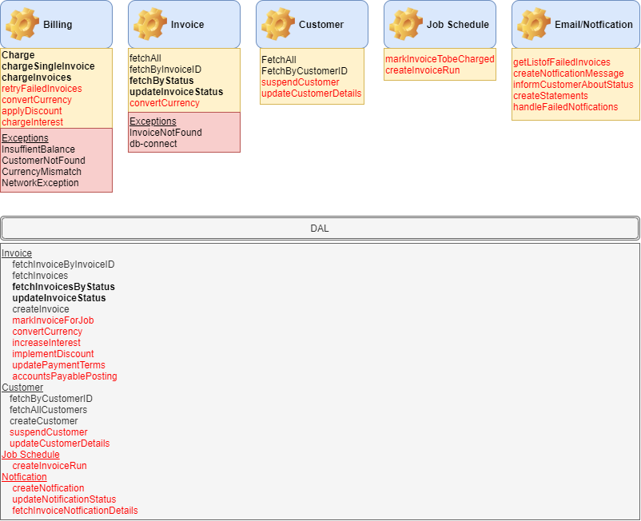

## Antaeus

Antaeus (/ænˈtiːəs/), in Greek mythology, a giant of Libya, the son of the sea god Poseidon and the Earth goddess Gaia. He compelled all strangers who were passing through the country to wrestle with him. Whenever Antaeus touched the Earth (his mother), his strength was renewed, so that even if thrown to the ground, he was invincible. Heracles, in combat with him, discovered the source of his strength and, lifting him up from Earth, crushed him to death.

Welcome to our challenge.

## The challenge

As most "Software as a Service" (SaaS) companies, Pleo needs to charge a subscription fee every month. Our database contains a few invoices for the different markets in which we operate. Your task is to build the logic that will schedule payment of those invoices on the first of the month. While this may seem simple, there is space for some decisions to be taken and you will be expected to justify them.

## Instructions

Fork this repo with your solution. Ideally, we'd like to see your progression through commits, and don't forget to update the README.md to explain your thought process.

Please let us know how long the challenge takes you. We're not looking for how speedy or lengthy you are. It's just really to give us a clearer idea of what you've produced in the time you decided to take. Feel free to go as big or as small as you want.

## Developing

Requirements:
- \>= Java 11 environment

Open the project using your favorite text editor. If you are using IntelliJ, you can open the `build.gradle.kts` file and it is gonna setup the project in the IDE for you.

### Building

```
./gradlew build
```

### Running

There are 2 options for running Anteus. You either need libsqlite3 or docker. Docker is easier but requires some docker knowledge. We do recommend docker though.

*Running Natively*

Native java with sqlite (requires libsqlite3):

If you use homebrew on MacOS `brew install sqlite`.

```
./gradlew run
```

*Running through docker*

Install docker for your platform

```
docker build -t antaeus
docker run antaeus
```

### App Structure
The code given is structured as follows. Feel free however to modify the structure to fit your needs.
```
├── buildSrc
|  | gradle build scripts and project wide dependency declarations
|  └ src/main/kotlin/utils.kt 
|      Dependencies
|
├── pleo-antaeus-app
|       main() & initialization
|
├── pleo-antaeus-core
|       This is probably where you will introduce most of your new code.
|       Pay attention to the PaymentProvider and BillingService class.
|
├── pleo-antaeus-data
|       Module interfacing with the database. Contains the database 
|       models, mappings and access layer.
|
├── pleo-antaeus-models
|       Definition of the Internal and API models used throughout the
|       application.
|
└── pleo-antaeus-rest
        Entry point for HTTP REST API. This is where the routes are defined.
```

### Main Libraries and dependencies
* [Exposed](https://github.com/JetBrains/Exposed) - DSL for type-safe SQL
* [Javalin](https://javalin.io/) - Simple web framework (for REST)
* [kotlin-logging](https://github.com/MicroUtils/kotlin-logging) - Simple logging framework for Kotlin
* [JUnit 5](https://junit.org/junit5/) - Testing framework
* [Mockk](https://mockk.io/) - Mocking library
* [Sqlite3](https://sqlite.org/index.html) - Database storage engine

Happy hacking 😁!

## My Take on it!
2020/07/25
Not a Java expert nor Kotlin but I enjoy solving puzzles... 

Challenge: "few invoices for the different markets ... schedule payment of those invoices on the first of the month".

### App
Backend to charge invoices on a specific day of month.

As-Is


To-Be




Invoices 
A. Check Status / keep track
B. Update Status
C. Check Customer Currency / Convert
D. Retry Failed Invoices
E. Apply Discount
F. Charge Interest due to Overdue Invoices

It should handle exceptions like:
1. Network issues 
2. Currency Mismatches 
3. Insufficient balance 
4. Customers Not Found

Customer
A. Suspend Customer
B. Update Customer Details (Currency)

Job Schedule
A. Mark Invoices to be Charged for Next Run
B. Schedule a Monthly Job

Email / Notification
A. Get a List of Failed Invoices to be checked -> Escalated
B. Create a Notification Message
C. Inform Customer about Invoice Status


### PLEO-ANTAEUS-CORE:
### SERVICE
#### Invoice  
Present:
Functions ->
Fetch All Invoices
Fetch Invoice By ID
ToDo: 
Functions ->
Update Invoice: Paid to be done (Not Paid / Error) - Done
Fetch Invoice(s) by Status - Done
convertCurrency

#### Billing 
Present: 
Functions ->
Charge (TODO)
ToDO:
Functions ->
Charge Single Invoice - Done
Charge All Invoices create logger - Done
Check status of Invoice before trying to Charge(paymentProvider) - Done
        Exceptions:
        ChecktheCurrency 
        handleNetworkIssues
HandleFailedInvoices - retry
applyDiscount
chargeInterest


#### Customer
Present: 
Functions ->
FectchAll Customers
FecthByID
ToDo:
suspendCustomerSubscription
updateCustomerDetails

#### Job Schedule
markInvoicesToBeCharged
createInvoiceRun

#### Email/Notification
getListOfFailedInvoices
createNotificationMessage
InformCustomeraboutStatus
createStatements
handleFailedNotifications


